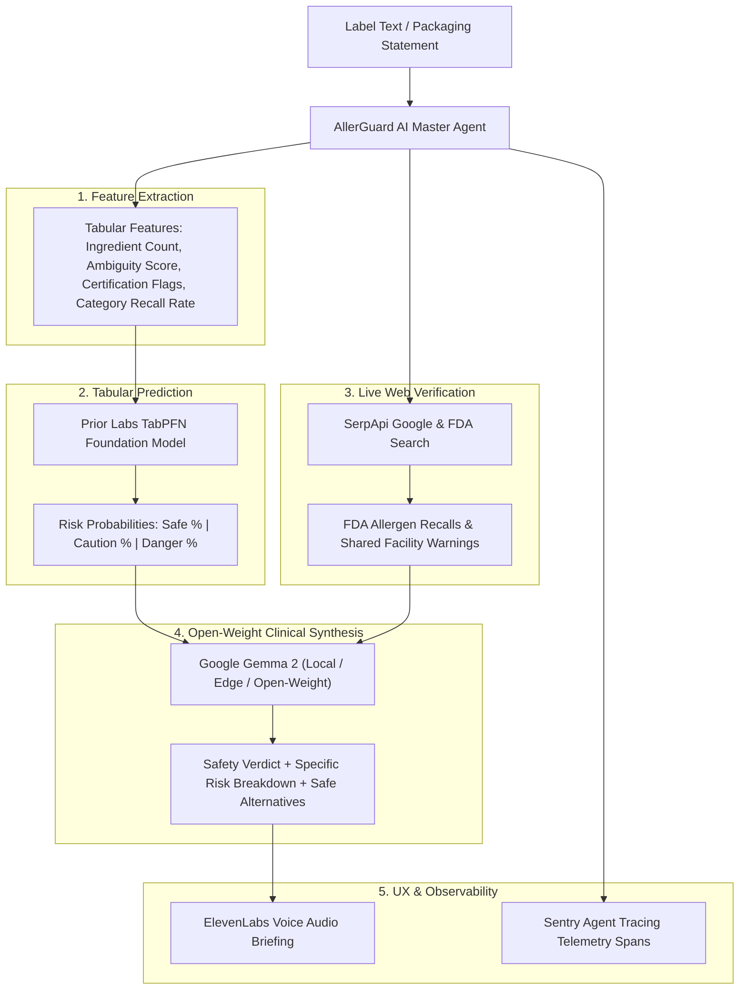

# 🛡️ AllerGuard AI: Open-Source Dietary Guardian

> **Built for Maya** — for the [Hacktoberfest Weekend DEV Challenge: Build for a Friend](https://dev.to/challenges/hacktoberfest-weekend-2026-10-01)  
> *A private, offline-first clinical food safety guardian protecting a loved one with severe Celiac disease and tree nut anaphylaxis risk.*

---

## 🌟 The Story & Problem
Maya is my close friend and roommate. Living with both **severe Celiac disease** (strict 0 ppm gluten tolerance) and **anaphylactic tree nut allergies**, everyday life revolves around a high-stress minefield of grocery packaging and dining out. 

- **Deceptive Labeling:** "Natural flavors", "modified food starch", "spices", or vague caramel colorings often conceal wheat binders or nut extracts.
- **Shared Facilities:** Products with clean ingredient lists often turn out to be manufactured on shared conveyor lines or processing equipment with nuts and wheat.
- **The Cloud AI Failure Mode:** Commercial cloud AI assistants require an active internet connection (failing in grocery store basements), hallucinate medical safety, and transmit private medical/dietary profiles to commercial tracking servers.

**AllerGuard AI** was built to solve this: an open-source, local-first dietary guardian that combines **Prior Labs' TabPFN** tabular foundation model, **Google Gemma 2** open-weight reasoning, **SerpApi** live food recall verification, **Sentry Agent Tracing**, and **ElevenLabs** hands-free voice alerts.

---

## 🏗️ Architecture



---

## 🎯 Partner Category Integrations

| Partner Category | Role in AllerGuard AI |
| :--- | :--- |
| **Best Use of Gemma** ($200 - Featured) | Powers the clinical reasoning engine (**Gemma 2**), evaluating Celiac autoimmune triggers, identifying ambiguous binders, and recommending certified safe substitutions. Runs locally or via open endpoints. |
| **Best Use of TabPFN** ($200 - Featured) | Uses Prior Labs' **TabPFN** tabular foundation model to analyze multi-dimensional manufacturing risk features (ingredient count, ambiguity score, GF certification, dedicated facility, historical category recall rates) in a single zero-shot forward pass. |
| **Best Use of Render** ($200 - Featured) | Turnkey deployment configured via `render.yaml` blueprint, production `Dockerfile`, and automated `/api/health` probes. |
| **Best Use of Sentry Agent Tracing** ($100) | Instruments every agent execution span (`tabpfn.classify`, `serpapi.search`, `gemma.inference`, `elevenlabs.tts`) with millisecond latency and token telemetry. |
| **Best Use of SerpApi** ($100) | Live web search tool cross-referencing FDA allergen recall databases and manufacturer shared equipment disclosures. |
| **Best Use of ElevenLabs** ($100) | Generates hands-free voice audio summaries so Maya can hear safety verdicts while pushing a shopping cart or cooking. |

---

## 🚀 Quickstart & Local Installation

### Prerequisites
- Python 3.11+
- Git

### 1. Clone & Setup Environment
```bash
git clone https://github.com/your-username/allerguard-ai.git
cd allerguard-ai

python -m venv venv
# On Windows:
.\venv\Scripts\activate
# On macOS/Linux:
source venv/bin/activate

pip install -r requirements.txt
```

### 2. Configure Environment (Optional)
Copy `.env.example` to `.env`:
```bash
cp .env.example .env
```
*(AllerGuard AI includes deterministic local offline engines and pre-calibrated tabular datasets; it runs end-to-end out of the box even without external API keys!)*

### 3. Run Tests
```bash
pytest -v
```

### 4. Start the Application
```bash
uvicorn app.main:app --reload --port 8000
```
Open **`http://localhost:8000`** in your browser.

---

## 📦 Deployment to Render

Deploy with one click using the included `render.yaml`:
1. Connect your GitHub repository to Render.
2. Select **New Blueprint Instance**.
3. Render automatically provisions the web service, mounts environment variables, and launches with zero configuration.

---

## 🔒 Why Open Innovation Matters
- **100% On-Device Privacy:** Health profiles, autoimmune conditions, and dietary restrictions never leak to third-party ad brokers.
- **Offline Reliability:** Works in rural stores or supermarket basements with zero mobile coverage.
- **Zero Ongoing Cost:** Medical safety should not be gated behind monthly per-token API subscriptions.

---

## 📜 License
MIT License. Built for Maya and open to everyone managing severe dietary restrictions.
