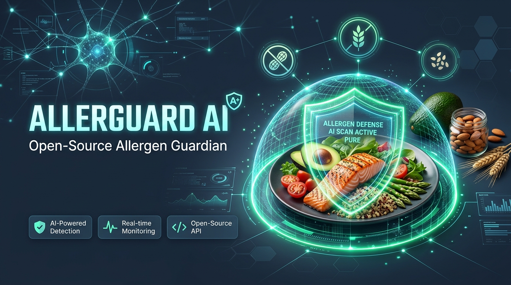

# 🛡️ AllerGuard AI: Open-Source Dietary & Allergen Guardian

> **Built for Friends & Family Cooking for Severe Allergies** — for the [Hacktoberfest Weekend DEV Challenge: Build for a Friend](https://dev.to/challenges/hacktoberfest-weekend-2026-10-01)  
> *A private, offline-first food safety guardian protecting against life-threatening Tree Nut, Peanut, Coconut, and Sesame allergies.*

🌐 **Live Interactive Demo:** [https://allerguard-ai-5lim.onrender.com](https://allerguard-ai-5lim.onrender.com)  
👉 **GitHub Repository:** [https://github.com/SixFiveMil/allerguard-ai](https://github.com/SixFiveMil/allerguard-ai)

---

## 🌟 The Story & Problem
I live with life-threatening anaphylactic allergies to **Tree Nuts, Peanuts, Coconut, and Sesame**. 

Whenever friends, roommates, or family invite me over for dinner, cook a holiday meal, or pick up groceries, an innocent dinner party becomes a high-stakes anxiety test. Nobody wants to send their friend to the emergency room with an epinephrine auto-injector, but navigating the modern grocery aisle without a medical degree is nearly impossible:

- **Deceptive Camouflage & Alternate Names:** Sesame hides under *tahini, benne seeds, halvah, and gomasio*. Peanuts hide as *arachis oil*. Tree nuts hide as *marzipan, gianduja, and praline*. Coconut is ubiquitous in vegan cheeses, non-dairy creamers, and disguised as *MCT oil* or *copra*.
- **Vague Commercial Binders:** Labels listing "natural flavors", "cold-pressed oils", "vegetable emulsifiers", or "spice blends" frequently mask cross-reactive nut derivatives or cold-pressed sesame extracts.
- **Shared Facilities & Cross-Contact:** Products with seemingly safe ingredient lists are frequently processed on shared equipment with peanut flour or crushed sesame seeds without bolded front-of-package warnings.
- **The Cloud AI Failure Mode:** Commercial cloud AI assistants require active cell signals (failing in grocery store basements), hallucinate medical safety on ambiguous food additives, and transmit sensitive health data to commercial ad brokers.

**AllerGuard AI** was built so my friends and family—and anyone managing severe food allergies—have an instant, offline-capable guardian. It combines **Prior Labs' TabPFN** tabular foundation model, **Google Gemma 2** open-weight clinical reasoning, **SerpApi** live FDA recall verification, **Sentry Agent Tracing**, and **ElevenLabs** hands-free voice alerts.

---

## 🏗️ Architecture


---

## 🎯 Partner Category Integrations

| Partner Category | Role in AllerGuard AI |
| :--- | :--- |
| **Best Use of Gemma** ($200 - Featured) | Powers the clinical reasoning engine (**Gemma 2**), evaluating anaphylactic hazards (tree nuts, peanuts, coconut, sesame), identifying ambiguous binders, and recommending safe substitutions. Runs locally or via open endpoints. |
| **Best Use of TabPFN** ($200 - Featured) | Uses Prior Labs' **TabPFN** tabular foundation model to analyze multi-dimensional manufacturing risk features (ingredient count, ambiguity score, dedicated facility, allergen-free certification, historical category recall rates) in a single zero-shot forward pass. |
| **Best Use of Render** ($200 - Featured) | Turnkey deployment configured via `render.yaml` blueprint, production `Dockerfile`, and automated `/api/health` probes. |
| **Best Use of Sentry Agent Tracing** ($100) | Instruments every agent execution span (`tabpfn.classify`, `serpapi.search`, `gemma.inference`, `elevenlabs.tts`) with millisecond latency and token telemetry. |
| **Best Use of SerpApi** ($100) | Live web search tool cross-referencing FDA allergen recall databases and manufacturer shared equipment disclosures. |
| **Best Use of ElevenLabs** ($100) | Generates hands-free voice audio summaries so friends or family can hear instant safety verdicts while pushing a shopping cart or cooking in the kitchen. |

---

## 🚀 Quickstart & Local Installation

### Prerequisites
- Python 3.11+
- Git

### 1. Clone & Setup Environment
```bash
git clone https://github.com/your-username/allerguard-ai.git
cd allerguard-ai

python -m venv venv
# On Windows:
.\venv\Scripts\activate
# On macOS/Linux:
source venv/bin/activate

pip install -r requirements.txt
```

### 2. Configure Environment (Optional)
Copy `.env.example` to `.env`:
```bash
cp .env.example .env
```
*(AllerGuard AI includes deterministic local offline engines and pre-calibrated tabular datasets; it runs end-to-end out of the box even without external API keys!)*

### 3. Run Tests
```bash
pytest -v
```

### 4. Start the Application
```bash
uvicorn app.main:app --reload --port 8000
```
Open **`http://localhost:8000`** in your browser.

---

## 📦 Deployment to Render

Deploy with one click using the included `render.yaml`:
1. Connect your GitHub repository to Render.
2. Select **New Blueprint Instance**.
3. Render automatically provisions the web service, mounts environment variables, and launches with zero configuration.

---

## 🔒 Why Open Innovation Matters
- **100% On-Device Privacy:** Health profiles, autoimmune conditions, and dietary restrictions never leak to third-party ad brokers.
- **Offline Reliability:** Works in rural stores or supermarket basements with zero mobile coverage.
- **Zero Ongoing Cost:** Medical safety should not be gated behind monthly per-token API subscriptions.

---

## 📜 License
MIT License. Built for friends, family, and anyone managing life-threatening food allergies.
